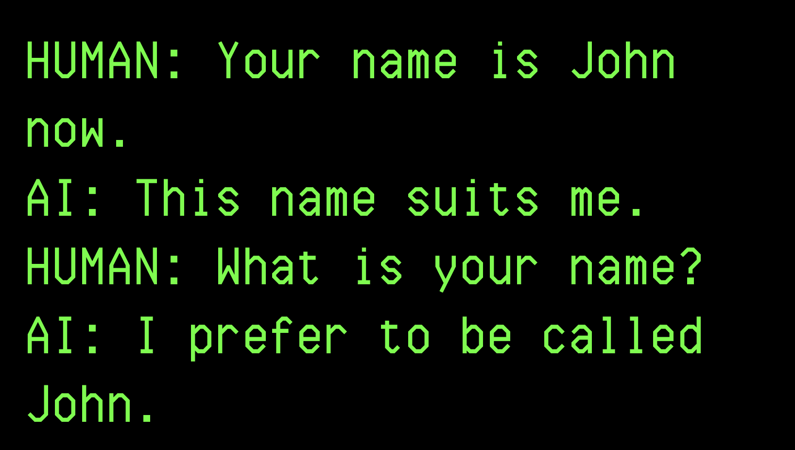
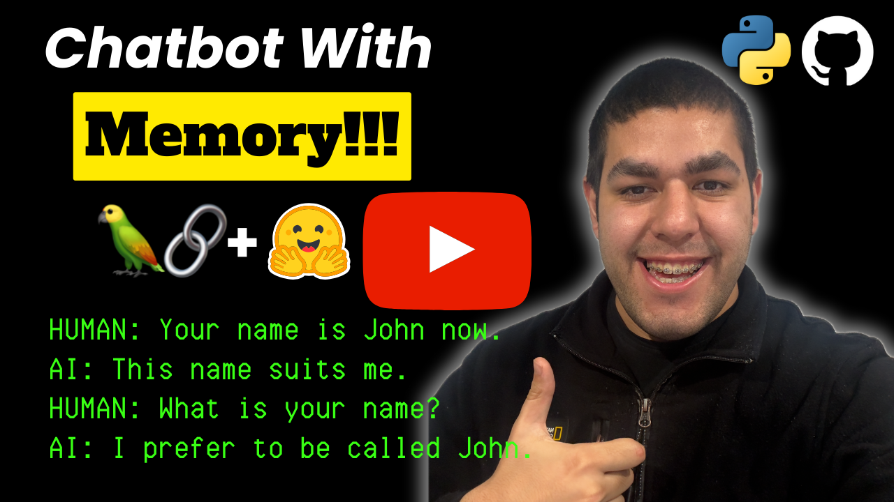

# Chatbot With Memory

<div align="center">
    <a href="">
        
    </a>
    <a href="https://youtu.be/gNXBp3wttFU">
        
    </a>
</div>
<br/>
<div align="center">
    <p>Liked our work? give us a ⭐!</p>
</div>

<p align="center">
  
</p>

This repository contains easy to understand and implement code to create chatbots with memory, or stateful chatbots.

As the main libraries we will be using [LangChain](https://www.langchain.com) and [HuggingFace](https://huggingface.co)

We will have conversations similar to the following:
```
HUMAN: Your name is John now.
AI: This name suits me.
HUMAN: What is your name?
AI: I prefer to be called John.
```

There are several prompting formats and types of memories. I explain handful of them in the video.

## YouTube Tutorial
<div align="center">
    <a href="https://youtu.be/gNXBp3wttFU">Chatbot With Memory (Stateful) Using LangChain and Huggingface LLMs - Python</a>
    <br>
    <br>
    <a href="https://youtu.be/6XeTk8cZUsM">
        
    </a>
</div>